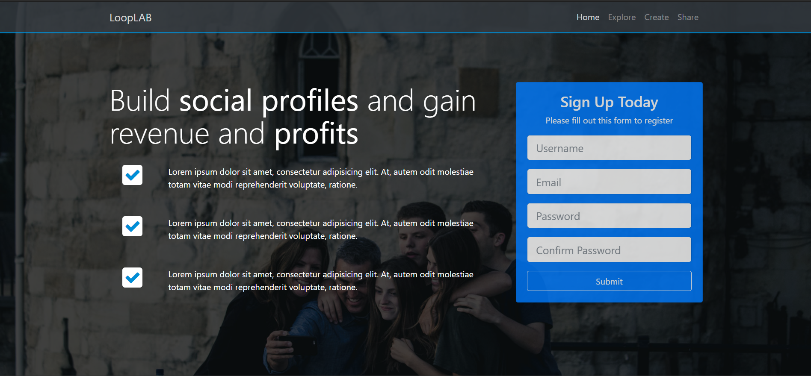
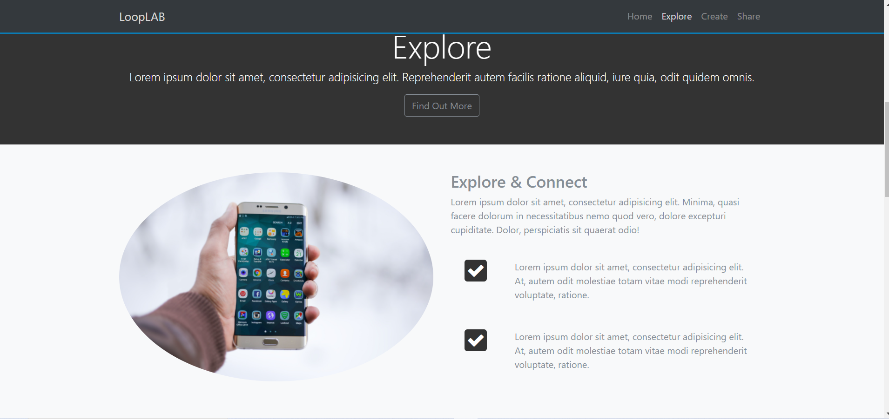
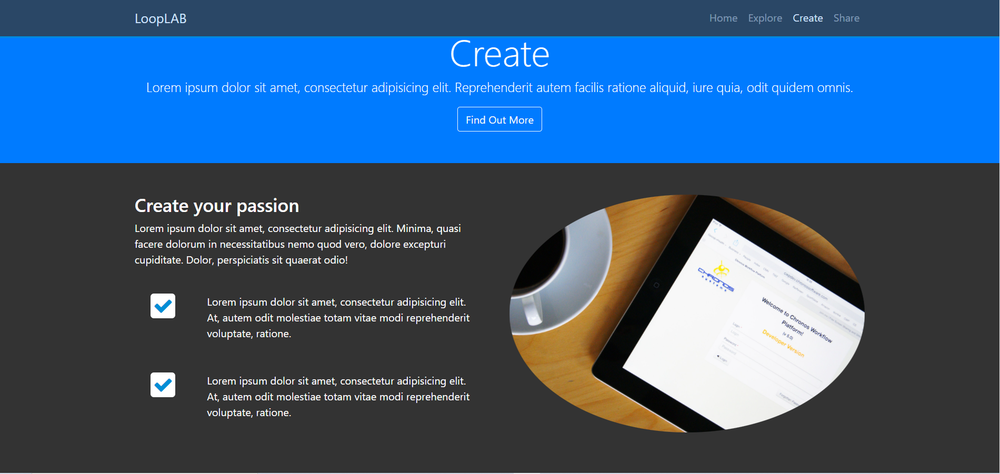

# loopLab

## Description
Landing page for a networking site.  Includes form and modal form to allow user to sign up for services.  Features animated scroll to page sections from navbar links.

##### Landing Page Hero View

##### Explore View

##### Create View

##### Share View

Visit site [here](https://christopherconcannon.github.io/loop-lab/)

## Table of Contents
  * [Installation](#installation)
  * [Usage](#usage)
  * [License](#license)
  * [Technologies](#technologies)
  * [Contributing](#contributing)
  * [Testing](#testing)
  * [Questions](#questions)
  
## Installation
Clone project to a directory on your local machine and cd into src directory.  

## Usage
Open index.html page in browser of your choice and use navigation links to move throughout the page.  Fill out form to contact LoopLAB 

## License 
This project is covered under the MIT license 

## Technologies 
HTML5, CSS3, JavaScript, Bootstrap, SCSS

## Contributing
To see the guidelines adopted for contributing to this project, please view the [Contributor Covenant](https://www.contributor-covenant.org/version/2/0/code_of_conduct/code_of_conduct.txt)

## Testing
Tests coming soon

## Questions
Visit me at GitHub  
[christopherConcannon](https://github.com/christopherConcannon)
  
If you have any questions or would like to contact me, please email me at  
[cmcon@yahoo.com](mailto:cmcon@yahoo.com)
